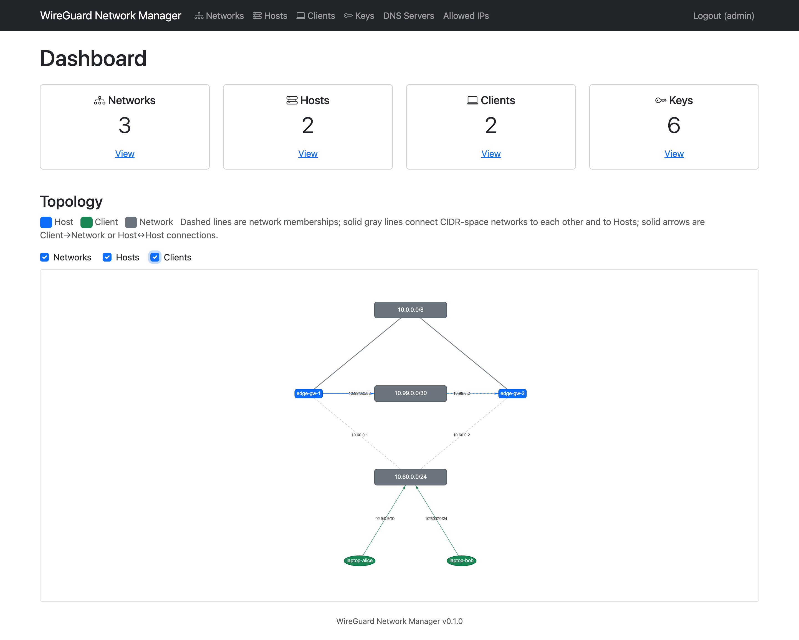
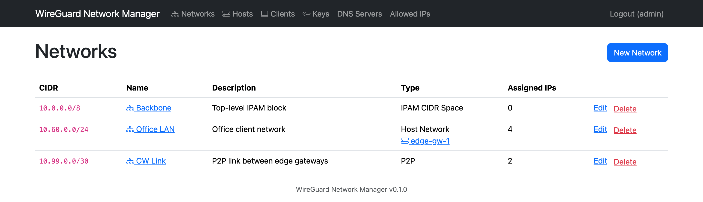
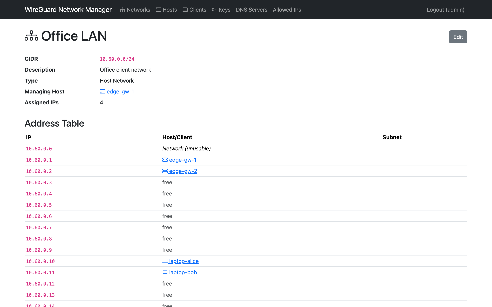
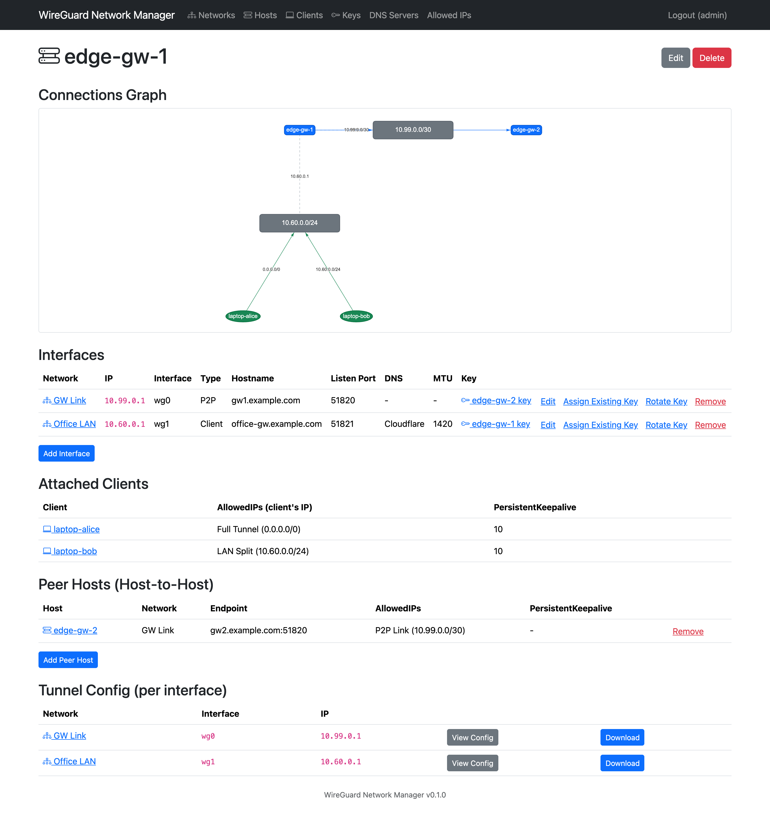
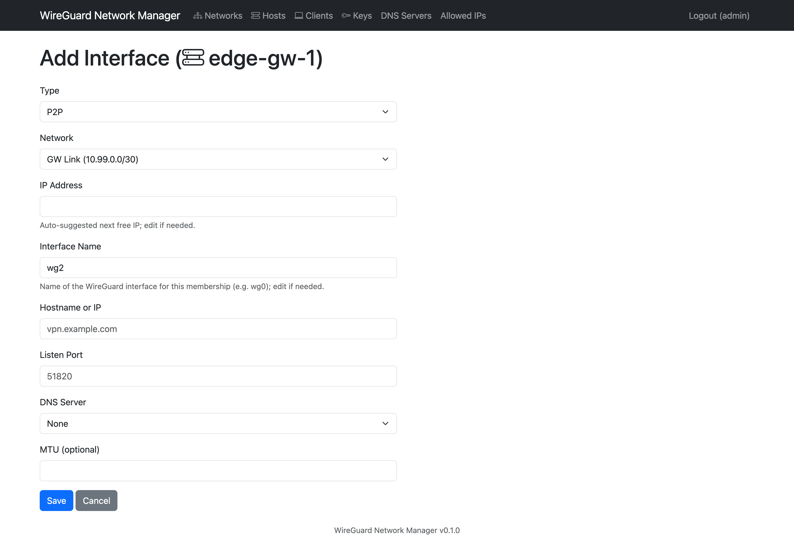
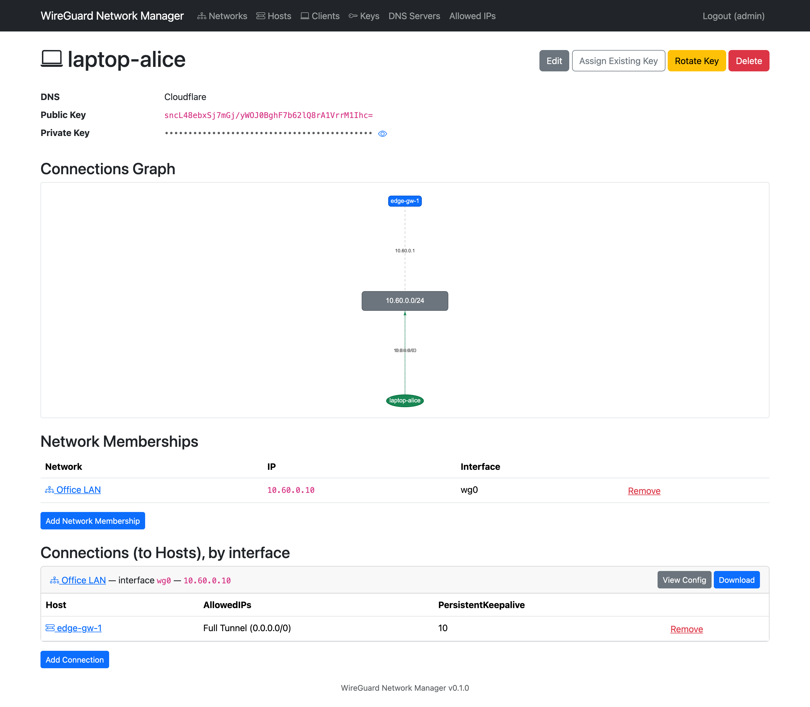
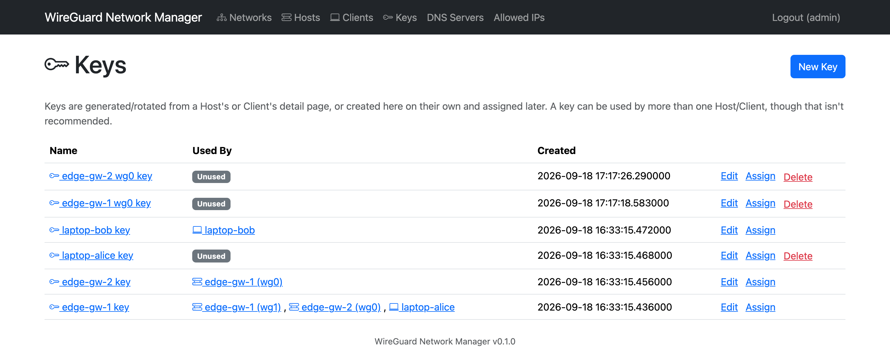
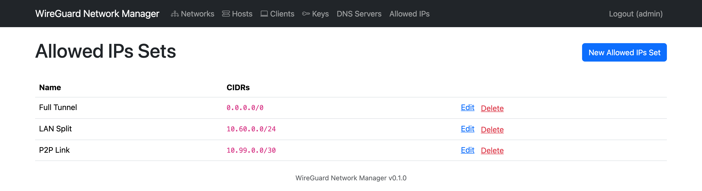
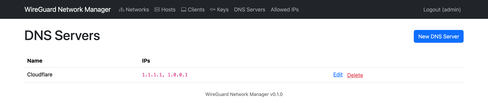

<!-- Copyright © 2026 Isaac Behrens. All rights reserved. -->

# WireGuard Network Manager

**Plan your WireGuard estate, not just your tunnels.** A self-hosted web app
that keeps your hosts, clients, IP space, and keys in one place — and hands you
ready-to-use `wg-quick` config files for every interface.

[](LICENSE)
[](https://hub.docker.com/r/ibehren1/wireguard-network-manager)




## Why

WireGuard is wonderfully simple per tunnel and unhelpfully silent about
everything above it. Once you pass a handful of peers, the real work isn't
running `wg genkey` — it's remembering which `/30` links which gateways, which
address in `10.60.0.0/24` is still free, which key is on which interface, and
which of the six `.conf` files on your laptop is the current one.

WireGuard Network Manager models that layer. You describe your networks, hosts,
clients, and how they connect; it assigns addresses, generates and tracks keys,
draws the topology, and renders the config files. One admin account, one
container, no agent to install on your gateways — it produces configs, it
doesn't reach into your boxes.

## Features

### IP address management, built in

Every network is a CIDR pool. Attach a host or client and the next free address
is assigned automatically — editable if you want a specific one, validated
against duplicates. Networks are typed, so the app knows the difference between
a `/8` you're using to organize address space, a `/30` point-to-point link, and
a client-facing LAN managed by one of your hosts.



Each network gets a full address table — every address in the range, what's on
it, and what's still free.



### Hosts are collections of interfaces

A real gateway has more than one interface, and each one is its own WireGuard
identity: its own key, listen port, DNS, and MTU. Hosts here are modeled that
way — add interfaces per network, typed as a point-to-point link, a
client-facing interface, or a plain non-WireGuard NIC you just want tracked for
IPAM purposes.



Adding an interface is one form, with the address pre-filled from the network's
free pool.



### Clients that just work

A client points at one or more hosts on a network it belongs to. Pick an
AllowedIPs preset — full tunnel, split tunnel, whatever you've defined — and
you're done. Need redundancy? Attach the client to two hosts on the same
network and both land in the exported config as separate `[Peer]` blocks.



### Config files, generated per interface

One interface, one `.conf` file — viewable in the browser or downloadable from
the host or client it belongs to. A client export also accepts an
`?allowed_ips_override=...` query parameter, for a one-off variant you don't
want to store.

```ini
[Interface]
PrivateKey = <decrypted at export time>
Address = 10.60.0.10/24
DNS = 1.1.1.1, 1.0.0.1

[Peer]  # Host: edge-gw-1
PublicKey = sncL48ebxSj7mGj/yWOJ0BghF7b62lQ8rA1VrrM1Ihc=
Endpoint = office-gw.example.com:51821
AllowedIPs = 0.0.0.0/0
PersistentKeepalive = 10
```

Endpoints and peer public keys are always resolved from the peer's own
interface on the shared network, so a two-interface gateway never exports the
wrong key or port.

### Keys you can actually keep track of

Keys are generated in pure Python (Curve25519 via PyNaCl — no shelling out to
`wg`) and stored encrypted at rest with Fernet. Every key has a name, and the
Keys page tells you exactly what's using it. Rotate an interface's key with one
click, assign an existing key to something else, or paste in a private key you
already have and let the app derive the public half. A key can't be deleted
while anything still references it.



### Reusable presets

Define your DNS servers and AllowedIPs sets once, then reference them by name
from hosts, interfaces, and client connections — no retyping `0.0.0.0/0` or
your resolver IPs into a dozen forms, and no orphaned references (a preset in
use can't be deleted).





### See the whole thing at once

The dashboard graph lays out your entire estate — IPAM blocks nested by CIDR
containment on top, hosts and their point-to-point links in the middle,
client-facing networks and clients below — with per-category filters. Every
host and client detail page carries a focused one-hop version of the same view.
Layout is static and deterministic: no physics jiggle, no dragging nodes around
to make sense of it.

## Quick start

You need Docker with Compose v2. Create a directory, drop in these two files,
and run one command.

`docker-compose.yml`:

```yaml
services:
  wireguard-network-manager:
    image: ibehren1/wireguard-network-manager:latest
    ports:
      - "8080:5000"
    environment:
      - MONGO_URI=mongodb://127.0.0.1:27017/wireguard_manager
      - SECRET_KEY=${SECRET_KEY:?SECRET_KEY is required}
      - ENCRYPTION_KEY=${ENCRYPTION_KEY:?ENCRYPTION_KEY is required}
      - ADMIN_USERNAME=${ADMIN_USERNAME:-admin}
      - ADMIN_PASSWORD=${ADMIN_PASSWORD:?ADMIN_PASSWORD is required}
    volumes:
      - mongo_data:/data/db
    restart: unless-stopped

volumes:
  mongo_data:
```

`.env`, next to it:

```bash
SECRET_KEY=<random string>
ENCRYPTION_KEY=<Fernet key>
ADMIN_USERNAME=admin
ADMIN_PASSWORD=<your password>
```

Generate the two secrets:

```bash
python3 -c "import secrets; print('SECRET_KEY=' + secrets.token_hex(32))"
python3 -c "from cryptography.fernet import Fernet; print('ENCRYPTION_KEY=' + Fernet.generate_key().decode())"
```

Then:

```bash
docker compose up -d
```

Open http://localhost:8080 and log in. The app server and MongoDB both run in
that one container; images are published for `linux/amd64` and `linux/arm64`.

### Configuration

| Variable | Required | Purpose |
| --- | --- | --- |
| `SECRET_KEY` | yes | Flask session signing key |
| `ENCRYPTION_KEY` | yes | Fernet key encrypting private keys at rest (keep it separate from `SECRET_KEY`) |
| `ADMIN_PASSWORD` | yes | Admin password, seeded on first run only |
| `ADMIN_USERNAME` | no (`admin`) | Admin username, seeded on first run only |
| `MONGO_URI` | no | Defaults to the bundled MongoDB inside the container |

Admin credentials are seeded **only while no user exists**. Changing them in
`.env` later has no effect on an existing install.

### Data and backups

Everything lives in MongoDB at `/data/db`, mounted from the `mongo_data`
volume, so data survives `docker compose down`, restarts, and image upgrades.
`docker compose down -v` deletes it. Back up the volume like any other Docker
volume — and remember that your `ENCRYPTION_KEY` is what makes the stored
private keys readable, so back that up too, separately.

### Before you expose it

- The compose file above binds port 8080 on **all** interfaces. Put a reverse
  proxy with TLS in front of it for anything beyond a trusted network — the app
  speaks plain HTTP and has no built-in rate limiting.
- It's a single-admin tool: one account, no roles, no audit log.
- Rotating an interface's or client's key immediately invalidates any config
  file you already handed out from the old key.

## Good to know

- **No agent, no `wg` on the server.** The app never touches a live WireGuard
  interface; it's a source of truth and a config generator. You still deploy
  the generated `.conf` files yourself.
- **IPv4 only** today.
- **No PresharedKey support** yet.
- **Per-interface configs only** — there's no single combined "everything this
  host is attached to" file, by design.

## Documentation

- [Development](docs/DEVELOPMENT.md) — build it from source, the local dev
  loop, dependency management, release builds, verification.
- [Architecture](docs/ARCHITECTURE.md) — blueprints, data model, request path,
  key design decisions.
- [CLAUDE.md](CLAUDE.md) — exhaustive behavioral spec and UI conventions.

## License

MIT — see [LICENSE](LICENSE). Copyright © 2026 Isaac Behrens. All rights
reserved.
