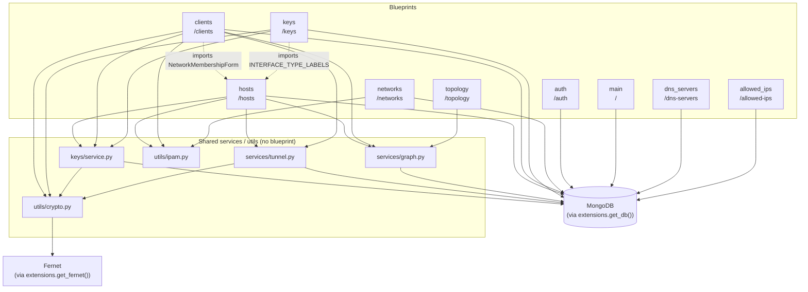
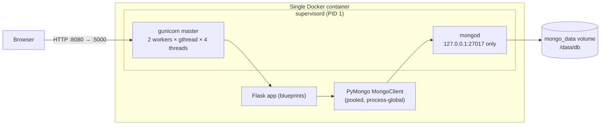
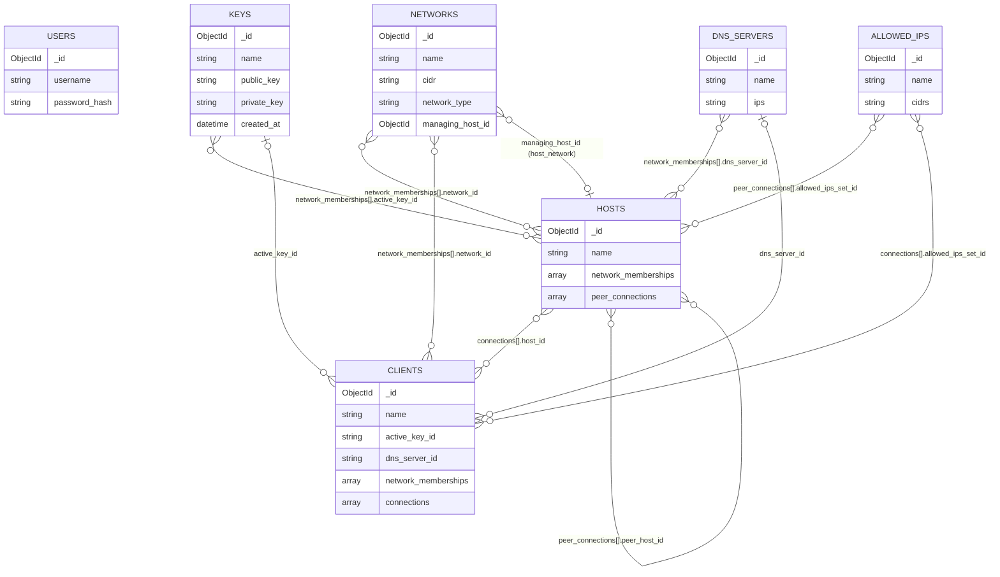

<!-- Copyright © 2026 Isaac Behrens. All rights reserved. -->

# Architecture

Onboarding reference for engineers new to this codebase. For day-to-day build
rules, exact form/field semantics, and the full topology-layout spec, see
[`CLAUDE.md`](../CLAUDE.md) — this document covers the shape of the system,
not every detail of its behavior. For how to build, run, and release the app,
see [`DEVELOPMENT.md`](DEVELOPMENT.md).

## 1. Overview

WireGuard Network Manager is a server-rendered Flask app for administering WireGuard
infrastructure: Hosts (servers), Clients (peers), Networks (IPAM pools/CIDR
blocks), and Keys (Curve25519 keypairs). It manages the associations between
these (which Host a Client connects to, which Network an interface lives on,
which Key an interface uses), auto-assigns IPs from a Network's CIDR, renders
`wg-quick`-compatible `.conf` files per interface, and visualizes the whole
topology as an interactive graph. It's a single-admin internal tool — no
multi-tenancy, no RBAC.

## 2. Component architecture

The app is a single Flask application (`app/__init__.py:create_app`)
composed of nine blueprints, each in its own package under `app/`, plus
shared service/util modules with no blueprint of their own. All blueprints
talk to MongoDB directly via `app.extensions.get_db()` (a process-global
`pymongo.MongoClient`, built once by `init_mongo()` during `create_app()` —
no per-request session object, no ODM).

`create_app()` itself does five things beyond registering blueprints: loads
`app/config.py:Config` (which reads the repo-root `VERSION` file once at
import), calls `init_mongo()` / `init_fernet()`, initializes Flask-Login
(`login_view = "auth.login"`), runs `app/bootstrap.py:ensure_admin_user()`
inside an app context, and registers a context processor exposing
`app_version` to every template.

**`auth`** (`url_prefix=/auth`) — login/logout. `app/auth/models.py` defines
the Flask-Login `User` wrapper and `user_loader` over the `users` collection.
Every other blueprint's routes are gated by `@login_required` against this.

**`main`** (no prefix, `/`) — the dashboard. Pulls collection counts and
embeds the global topology graph (fed by the `topology` blueprint's JSON
endpoint, client-side).

**`networks`** (`/networks`) — CRUD for Networks (CIDR + `network_type` +
optional `managing_host_id`), the per-network address table (`/networks/<id>`,
listing assignments up to 1024 addresses), and `/networks/<id>/next-free-ip`
(used by Host/Client forms' IP auto-fill). Uses `app/utils/ipam.py` for
CIDR/IP validation and free-IP search; queries `hosts`/`clients` directly to
compute IP usage (IPAM has no separate "assignment" collection — usage is
derived by scanning `network_memberships` on both).

**`hosts`** (`/hosts`) — CRUD for Hosts, and for each Host's *interfaces*
(`network_memberships` entries — one per Network the Host belongs to, each
with its own type, hostname/port/DNS/MTU, and key) and *peer connections*
(Host↔Host, for P2P links). Depends on `app/keys/service.py` (key
generation/assignment/rotation, per-interface), `app/services/tunnel.py`
(per-interface `.conf` rendering), `app/services/graph.py` (detail-page
graph), and `app/utils/ipam.py`.

**`clients`** (`/clients`) — CRUD for Clients, their network memberships, and
their `connections` (Client→Host, per Network). Same shared-service
dependencies as `hosts`, plus `app/utils/crypto.py` directly (for
`is_valid_wg_key`/`decrypt_private_key` on the detail/create pages) and a
direct import of `NetworkMembershipForm` from `app.hosts.forms` — Clients'
"add network membership" form is literally the Host interface form's base
class, reused across the blueprint boundary rather than duplicated.

**`keys`** (`/keys`) — standalone Key CRUD (create/edit-name/delete) and the
cross-entity `/keys/<id>/assign` picker (lists every Client and every
WireGuard-capable Host interface as assignment targets). Delegates all actual
storage/usage logic to `app/keys/service.py`. Also imports
`INTERFACE_TYPE_LABELS` from `app.hosts.forms` to label Host-interface
targets in that picker — another blueprint-boundary form/label reuse.

**`dns_servers`** (`/dns-servers`) and **`allowed_ips`** (`/allowed-ips`) —
small, near-identical CRUD blueprints for two reference collections consumed
by Hosts/Clients (DNS server presets, AllowedIPs CIDR presets). Each blocks
deletion while any Host/Client still references it (via a `_in_use` count
query against `hosts`/`clients`).

**`topology`** (`/topology`) — a single JSON endpoint,
`GET /topology/graph.json` (delegates to `build_full_graph()`), with no page
of its own. Feeds the dashboard's client-side vis-network render. Per-entity
graphs (`/hosts/<id>/graph.json`, `/clients/<id>/graph.json`) are instead
owned by the `hosts`/`clients` blueprints themselves, not this one.

**Shared, blueprint-less modules:**
- `app/services/tunnel.py` — builds one `wg-quick` `.conf` file (as a string)
  per interface; called by both `hosts` and `clients` routes.
- `app/services/graph.py` — builds vis-network-compatible node/edge JSON;
  called by `hosts`, `clients`, and `topology`.
- `app/keys/service.py` — key generation (PyNaCl), storage (Fernet-encrypted),
  assignment/rotation, and derived usage lookup; called by `hosts`, `clients`,
  and `keys` routes.
- `app/utils/crypto.py` — keypair generation/derivation (PyNaCl), Fernet
  encrypt/decrypt, key-format validation (`is_valid_wg_key`,
  `keypair_matches`). No Mongo and no Flask request/app context; its only
  in-project dependency is `get_fernet()` from `app/extensions.py`.
- `app/utils/ipam.py` — pure `ipaddress`-based CIDR/IP helpers. No Flask/Mongo
  dependency.
- `app/extensions.py` — process-global `MongoClient`/`Fernet`/`LoginManager`
  singletons and their `get_db()`/`get_fernet()` accessors.

## 3. Request / deployment architecture

Everything — app server and database — runs in **one Docker container**,
supervised by `supervisord` (`docker/supervisord.conf`, copied into the image
by `docker/Dockerfile`). `supervisord` runs two long-lived programs:

- `mongod`, bound to `127.0.0.1:27017` only (not exposed outside the
  container), data directory `/data/db` (a named volume, `mongo_data`, so
  data survives container recreation).
- the Flask app under `gunicorn`:
  `gunicorn -w 2 --worker-class gthread --threads 4 --timeout 60 -b 0.0.0.0:5000 wsgi:app`.
  Note **`gthread`, not the default `sync` worker class** — with `sync`
  workers, an idle keep-alive connection ties up an entire worker process
  (browsers hold several open per origin), and with only 2 workers it doesn't
  take much for both to be stuck that way, starving real requests until
  gunicorn's `--timeout` kills the stalled worker (visible as `CRITICAL
  WORKER TIMEOUT` in `webapp.err.log`). `gthread` lets each worker run
  multiple threads, so an idle connection occupies a thread, not a whole
  worker.

A request from the browser hits gunicorn on the container's port 5000
(mapped to host `8080` by `docker-compose.yml`), is dispatched to a thread in
one of the two worker processes, routed through Flask's blueprint URL map,
and any DB access goes through the process-global PyMongo `MongoClient` (one
client shared by all threads/workers within a process — PyMongo pools
connections internally) to `mongod` over localhost.

## 4. Data model

7 collections. Cross-references are almost all stored as **strings of the
referenced `ObjectId`** (e.g. `active_key_id`, `network_id`, `host_id`,
`peer_host_id`, `allowed_ips_set_id`, `dns_server_id`), matched at query time
with `str(...)` comparisons rather than casting back to `ObjectId` — the one
exception is `networks.managing_host_id`, which is stored as a real
`ObjectId`. Worth knowing before writing a raw Mongo query by hand.

**`users`** — `_id`, `username`, `password_hash`. Seeded once from
`ADMIN_USERNAME`/`ADMIN_PASSWORD` if empty (`app/bootstrap.py`). No other
collection references it.

**`networks`** — `_id`, `name`, `cidr`, `description`, `network_type` (one of
`p2p`, `ipam`, `host_network`; missing on old docs → treat as `"ipam"`),
`managing_host_id` (nullable `ObjectId` into `hosts`, only meaningful when
`network_type == "host_network"`). Pure IPAM pool — no stored "assignment"
subdocuments; a Network's used IPs are derived by scanning
`hosts.network_memberships` / `clients.network_memberships` for matching
`network_id`.

**`hosts`** — `_id`, `name`, plus two embedded arrays:
- `network_memberships[]`: one **interface** per entry — `network_id`, `ip`,
  `interface_name`, `interface_type` (`p2p` / `client` / `client_non_wg`;
  missing → `"client"`), `hostname`, `listen_port`, `dns_server_id`, `mtu`,
  `active_key_id`. `interface_type` constrains which `network_type` that
  interface may attach to (`p2p`→`p2p`, `client`/`client_non_wg`→
  `host_network`; `ipam` networks accept no interface). A Host has **no**
  top-level key/hostname/port/DNS/MTU — those all live per-interface, since
  each interface is a distinct WireGuard identity.
- `peer_connections[]`: Host↔Host P2P links, one per `p2p`-type interface —
  `peer_host_id`, `network_id`, `allowed_ips_set_id`, `endpoint_override`,
  `persistent_keepalive`. Created/removed reciprocally on both Hosts.

**`clients`** — `_id`, `name`, `active_key_id`, `dns_server_id`, plus:
- `network_memberships[]`: `network_id`, `ip`, `interface_name` — no
  `interface_type`, since a Client interface is always a plain WireGuard peer
  interface. Note the asymmetry: a Host interface's `network_type` is validated
  server-side (`INTERFACE_TYPE_NETWORK_TYPE` in `app/hosts/routes.py`), whereas
  a Client's membership form lists **every** Network unfiltered — attaching a
  Client only to `host_network` Networks is convention here, not enforcement.
- `connections[]`: `host_id`, `network_id`, `allowed_ips_set_id`,
  `persistent_keepalive` — one per Host the Client connects to, on a given
  Network; can have more than one entry for the same `network_id` (e.g. two
  Hosts on the same Network for redundancy).

**`keys`** — `_id`, `name`, `public_key`, `private_key` (Fernet-encrypted),
`created_at`. **No owner/back-reference field at all** — a key document
never records who uses it. "In use by" is derived entirely by reverse query
(`key_usages()` in `app/keys/service.py`, scanning
`hosts.network_memberships.active_key_id` and `clients.active_key_id`).
Deliberate: a key can be attached to zero, one, or many Host
interfaces/Clients simultaneously.

**`dns_servers`** — `_id`, `name`, `ips` (raw comma-delimited string,
verbatim). Referenced by `hosts.network_memberships[].dns_server_id` and
`clients.dns_server_id`.

**`allowed_ips`** — `_id`, `name`, `cidrs` (raw comma-delimited string,
verbatim). Referenced by `hosts.peer_connections[].allowed_ips_set_id` and
`clients.connections[].allowed_ips_set_id`.

Cardinalities are per-document, and the embedded arrays are what make most of
these many-to-many: a Host document holds many interfaces (each with its own
`active_key_id` / `dns_server_id`) and many `peer_connections` (each with its
own `allowed_ips_set_id`), so a single Host can reference several Keys, DNS
servers, or AllowedIPs sets at once — and each of those can be referenced by
several Hosts. The `|o--o{` edges are the single-valued, nullable ones: a
Client has at most one `active_key_id` and at most one `dns_server_id`, and
only a `host_network`-type Network carries a `managing_host_id` at all.

These lines are cardinality relationships, not pointers — read the label to
see which side actually stores the reference. For `KEYS`, `DNS_SERVERS`, and
`ALLOWED_IPS` the field always lives on the Host/Client side
(`active_key_id`, `dns_server_id`, `allowed_ips_set_id`); those three
collections carry no reciprocal field whatsoever. Answering "who uses this
key?" therefore means scanning the referencing collections — exactly what
`key_usages()` does — not reading anything off the key document.

## 5. Key architectural decisions

- **No ORM.** Every collection access is raw PyMongo (`get_db().<collection>`)
  — filters, `$set`/`$push`/`$pull`, `array_filters` for nested-array updates.
  No Mongoengine/ODM layer, no schema enforcement beyond what routes/forms
  check before writing.
- **Keys are not exclusively owned.** A key can be attached to zero, one, or
  many Host interfaces/Clients at once; the UI warns but never blocks this.
  Usage is always derived by reverse query, never stored on the key.
- **Tunnel configs are generated per interface, not per Host/Client.** Each
  `network_memberships` entry is independently exportable; there is no
  single "everything this Host/Client is attached to" config file.
- **Three Network types gate what can attach.** `p2p`, `ipam`, and
  `host_network` aren't just labels — `ipam` networks accept no Host/Client
  interface at all (pure CIDR-space bookkeeping), `p2p` networks only accept
  a Host's `p2p`-type interface (and back Host↔Host peering), and
  `host_network` networks are the only valid target for a Host's
  `client`/`client_non_wg` interface. That gate is enforced server-side for
  Host interfaces only; Client memberships are unvalidated against network
  type (see §4).
- **Private keys are only ever surfaced in two places** — a Client's detail
  page and a Key's own edit page — decrypted on the fly, masked behind a
  click-to-reveal control (`secret_reveal()` macro). Everywhere else a key is
  referenced, only its `name` is shown.
- **Everything runs in one container.** `mongod` and the Flask app are
  supervised as sibling processes by `supervisord`, not split into separate
  services/containers — simplicity over isolation, appropriate for a
  single-admin internal tool.

## 6. Topology visualization

`app/services/graph.py` builds vis-network-compatible `{nodes, edges}` JSON
consumed client-side (CDN `vis-network`, no build step, `physics: false`,
hierarchical layout with explicit per-node `level`). Three entry points:
`build_full_graph()` (dashboard's global graph, fed by
`GET /topology/graph.json`), `build_host_graph(host_id)` and
`build_client_graph(client_id)` (one-hop neighborhoods on each entity's
detail page, fed by `/hosts/<id>/graph.json` / `/clients/<id>/graph.json`).
Nodes are Networks (gray boxes, labeled by CIDR), Hosts (blue boxes), and
Clients (green ellipses); edges represent network membership, Client→Host
connections, Host↔Host peering, and Network supernet→subnet containment.
Neither connection type is ever drawn as a direct entity-to-entity line: a
Client's connection to a Host is drawn from the Client to the shared Network
node (`_connection_edge()`, since the Host already has its own membership edge
to that Network), and a Host↔Host peer connection becomes two segments routed
host→network→host (`_peer_edges()`). The three graphs use
different, non-interchangeable vertical-tier rules (Networks-on-top globally
vs. Hosts-on-top on the per-entity pages) — see CLAUDE.md's "Visual/UI
conventions" section for the full layout spec; this section is intentionally
just the map of what lives where.
